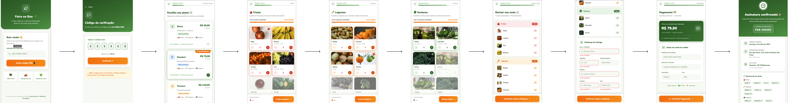
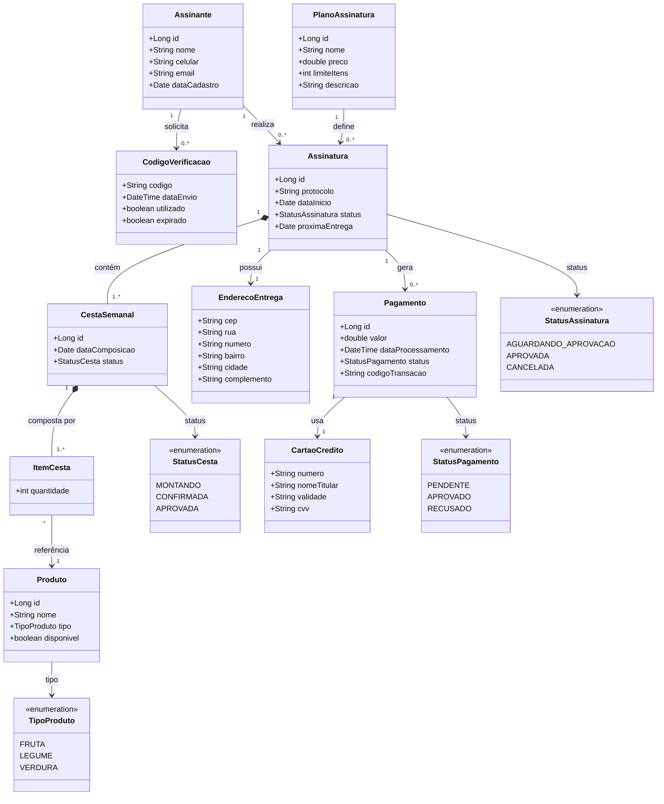

# Projeto de Software - Assinatura de Feira

## Visão geral
Cada vez mais os serviços de compra por assinatura têm se popularizado. Neste projeto, considera-se um serviço de assinatura semanal de frutas, legumes e verduras, inspirado em soluções como Feira na Box e Frutas em Casa.

O cenário de uso principal é Assinar Serviço de Feira, no qual o assinante seleciona plano, monta a cesta semanal, informa endereço de entrega e realiza o pagamento com validação junto à operadora de cartão de crédito.

- Ator principal: Assinante
- Ator secundário: Operadora de Cartão de Crédito
- Objetivo: realizar a assinatura de um plano de entrega semanal de produtos comercializados em feiras livres para entrega no endereço definido pelo assinante
- Pré-condições: planos de assinatura exibidos e catálogo de produtos da semana atualizado
- Pós-condição: informações do assinante validadas e armazenadas, plano selecionado armazenado, endereço validado e armazenado, preferências de entrega definidas e cesta da semana confirmada com pagamento aprovado

## Navegação rápida
- Fluxo visual do caso de uso: [wiki/user_flow.png](wiki/user_flow.png)
- Versão vetorial do fluxo: [wiki/user_flow.svg](wiki/user_flow.svg)
- Capturas das telas do protótipo: [wiki/telas](wiki/telas)

## Fluxo do caso de uso

## Storyboard de telas

⬇️

⬇️

⬇️

⬇️

⬇️

⬇️

⬇️

⬇️

⬇️

## Diagrama de Classes de Domínio

