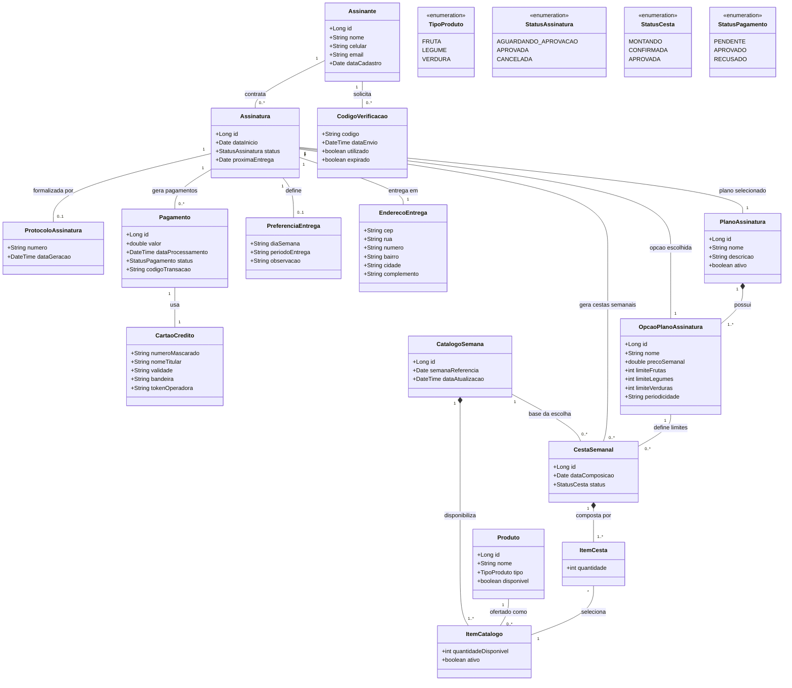
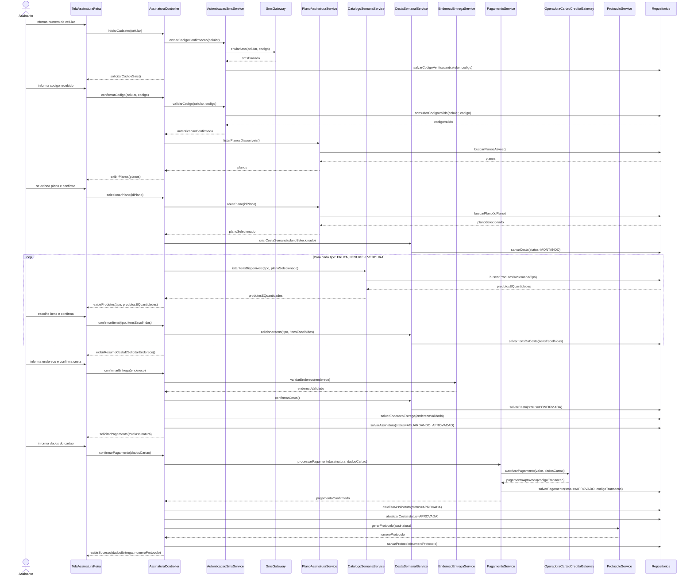
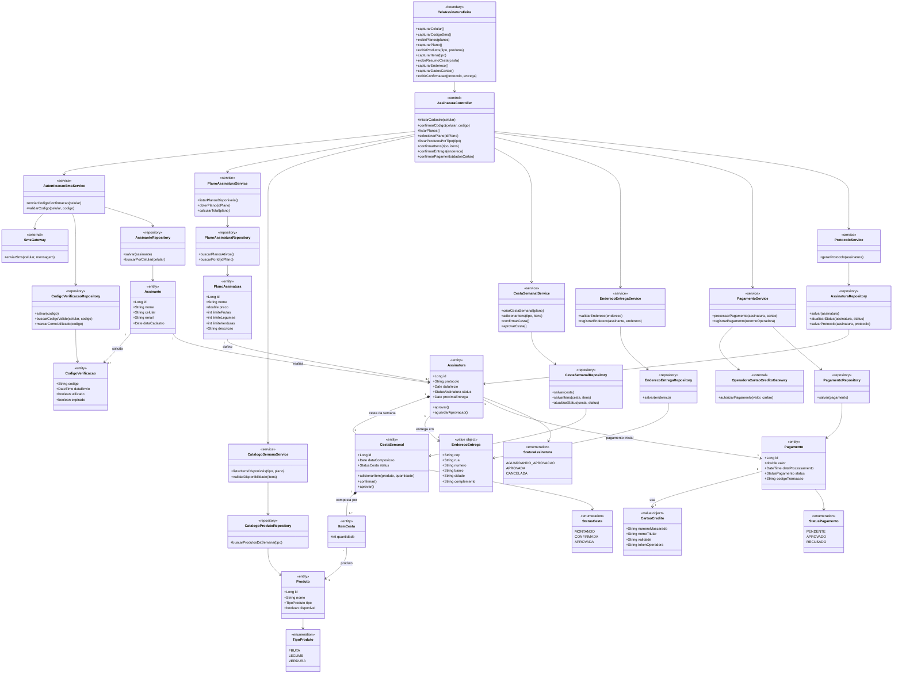

# Projeto de Software - Assinatura de Feira

## Navegação rápida

- [Visão geral](#visão-geral)
- [Fluxo do caso de uso](#fluxo-do-caso-de-uso)
- [Storyboard de telas](#storyboard-de-telas)
- [Diagrama de Classes de Domínio](#diagrama-de-classes-de-domínio)
- [Projeto do Caso de Uso: Assinar Serviço de Feira](#projeto-do-caso-de-uso-assinar-serviço-de-feira)
- [Diagrama de Sequência de Projeto](#diagrama-de-sequência-de-projeto)
- [Diagrama de Classes de Projeto](#diagrama-de-classes-de-projeto)

## Visão geral

Cada vez mais os serviços de compra por assinatura têm se popularizado. Neste projeto, considera-se um serviço de assinatura semanal de frutas, legumes e verduras, inspirado em soluções como Feira na Box e Frutas em Casa.

O cenário de uso principal é Assinar Serviço de Feira, no qual o assinante seleciona plano, monta a cesta semanal, informa endereço de entrega e realiza o pagamento com validação junto à operadora de cartão de crédito.

- Ator principal: Assinante
- Ator secundário: Operadora de Cartão de Crédito
- Objetivo: realizar a assinatura de um plano de entrega semanal de produtos comercializados em feiras livres para entrega no endereço definido pelo assinante
- Pré-condições: planos de assinatura exibidos e catálogo de produtos da semana atualizado
- Pós-condição: informações do assinante validadas e armazenadas, plano selecionado armazenado, endereço validado e armazenado, preferências de entrega definidas e cesta da semana confirmada com pagamento aprovado

## Fluxo do caso de uso

## Storyboard de telas

⬇️

⬇️

⬇️

⬇️

⬇️

⬇️

⬇️

⬇️

⬇️

## Diagrama de Classes de Domínio

## Projeto do Caso de Uso: Assinar Serviço de Feira

Os diagramas a seguir detalham o projeto do fluxo principal do caso de uso **Assinar Serviço de Feira**, mantendo correspondência com o fluxo visual e com as telas do protótipo. O projeto considera a separação entre interface, controle do caso de uso, serviços de aplicação, entidades de domínio, repositórios e integrações externas.

### Correspondência com o caso de uso e protótipo

| Etapa do fluxo principal | Responsabilidade de projeto                                                  | Referência no protótipo |
| ------------------------ | ---------------------------------------------------------------------------- | ----------------------- |
| 1 a 4                    | Identificar o assinante por celular, enviar SMS e validar o código informado | Telas 1 a 3             |
| 5 a 6                    | Exibir planos disponíveis e registrar o plano escolhido                      | Tela 4                  |
| 7 a 15                   | Buscar produtos por categoria e montar a cesta semanal                       | Telas 5 a 7             |
| 16 a 18                  | Exibir resumo da cesta, receber endereço e confirmar compra semanal          | Tela 8                  |
| 19 a 22                  | Colocar compra em aguardando aprovação, solicitar pagamento e validar cartão | Tela 9                  |
| 23 a 25                  | Aprovar assinatura/cesta, gerar protocolo e exibir confirmação               | Tela 10                 |

## Diagrama de Sequência de Projeto

## Diagrama de Classes de Projeto

